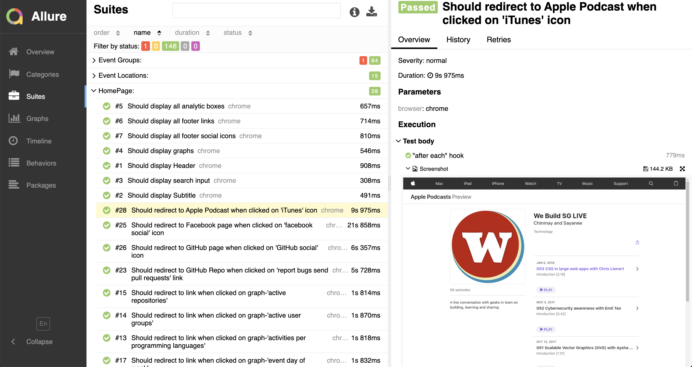

# WeBuildSg Automation Framework


This repository was created to functional test automation of [https://webuildsg.github.io](https://webuildsg.github.io/data).

Tecnologies used:
- [JavaScript (ECMAScript 6)](http://es6-features.org/#Constants)
- [Page Object Model](https://medium.com/tech-tajawal/page-object-model-pom-design-pattern-f9588630800b)
- [WebDriver.io](https://webdriver.io)
- [Docker](https://docker.com)
- [Selenium for docker](https://github.com/SeleniumHQ/docker-selenium)
- [Allure Reporter](https://docs.qameta.io/allure/)


## Usage

Clone this Repository

```sh
git clone https://github.com/svaru001/webuildsg.git
```

Install Dependancies

```sh
npm install
```

Run Tests in Docker (No Pre-setup required)

```sh
npm run docker-test
```

Run Allure Report to get detailed report with Screenshots

```sh
npm run report
```
## Allure reports (default)

you will be redirected to Allure HTML reporter after Test execution is finished.
You can Run Report explicitly 
```sh
npm run report
```




## Running test suit

To run our test suit:
- Open terminal.
- Navigate to the path the project was cloned in.
- Run `npm run docker-test`
- Ren `npm run report`